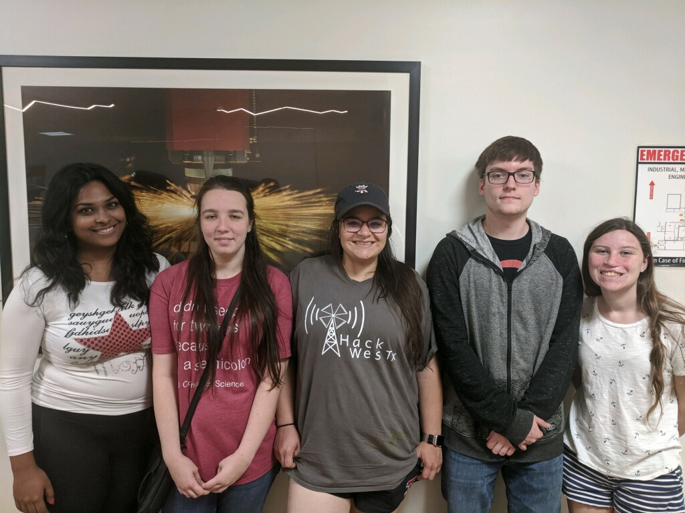
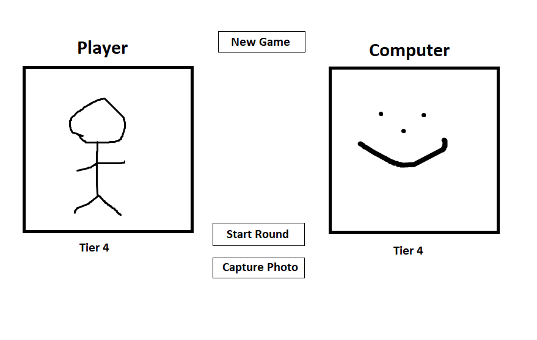
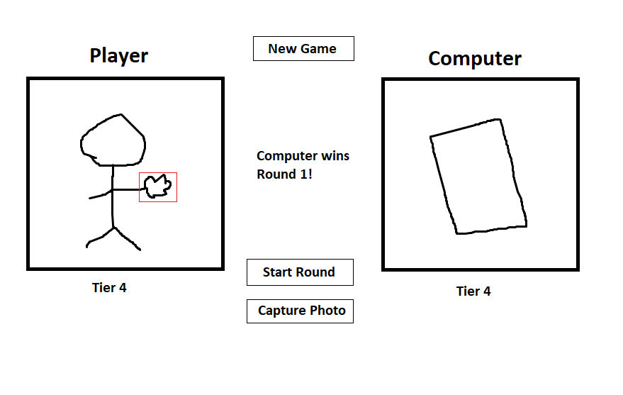
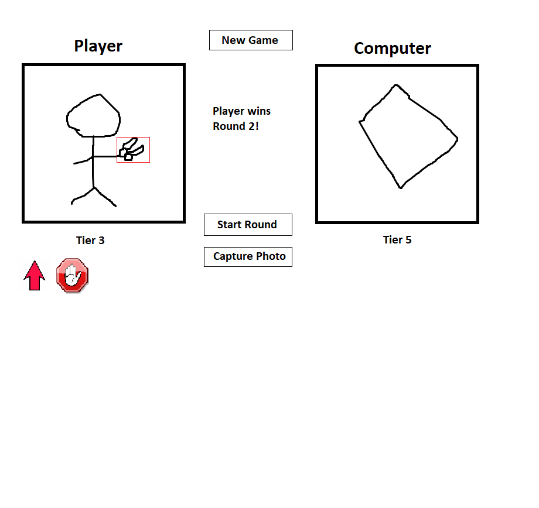
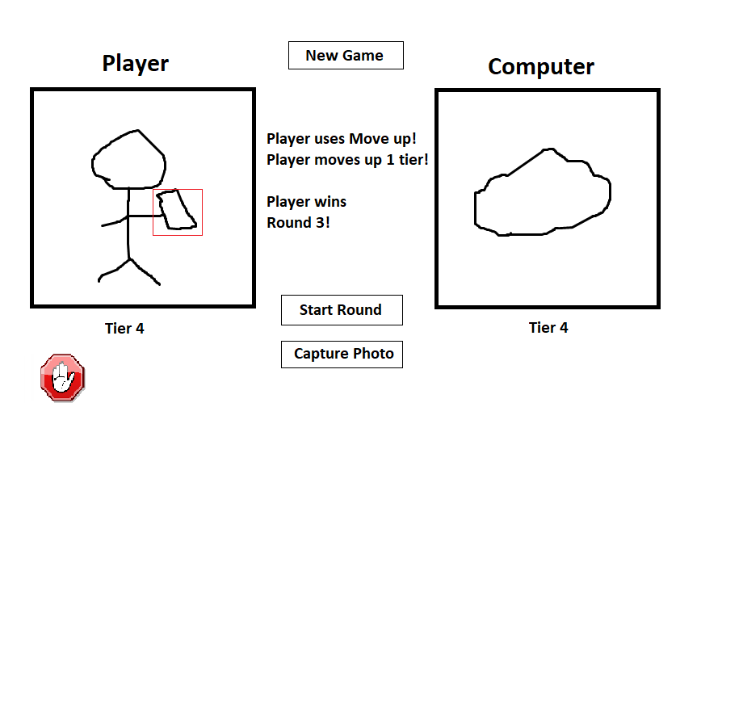
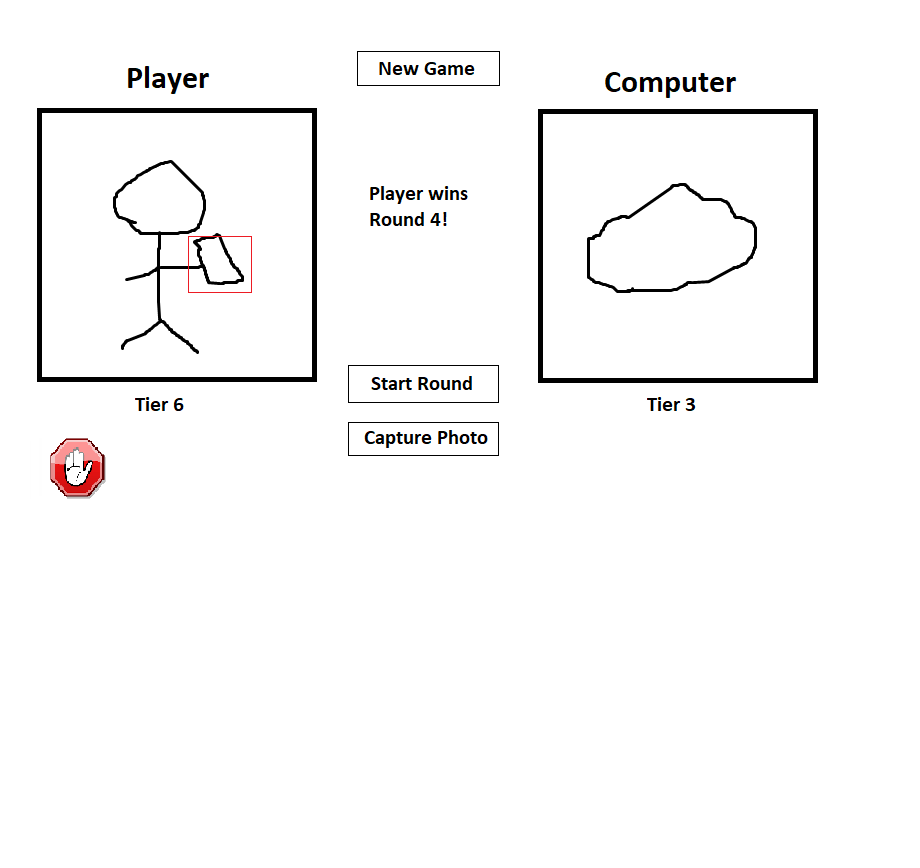

# Video Game Project

Human Computer Interaction Project 2

## Team members: ##

Charlotte Phillips - Team Leader (Game Interface)
  Charlotte is the Team Leader for this project, and will be in charge of the project's progression and checking in with the team members. Charlotte is also in charge of designing the main interface for the game.

Josephine Willgrubs - Programmer (Webcam/Object Detection)
  Josephine is one of the back-end programmers for this project. She is in charge of training the object detection classifier for the game.

Chloe Osgood - Programmer (Game Rules)
  Chloe is one of the back-end programmers for this projet. She will be responsible for how the game will play. She will be in charge of the game deciding who will win the round and how they will move up and down tiers. 

Aishwarya Anand - Programmer (Integration) Aishwarya is going to be working on the code that will help in linking objecy  detection to game interface and simultaneously also held responsible for designing and making sure that the projject design follows all the golden rules and other important design and good interface principles discusssed in class.

Donald Soundy - Programmer (Title Screen + Tutorial)
  Donald is going to be a front-end programmer for this project. He will be creating the title screen, and a game tutorial. The game tutorial will be describing the basic rules of rock paper scissors, and how to interact with the game with images and written documentation.

 

### Game interface ###
* Create buttons to control the main Rock, Paper, Scissors interface
* Observe the golden rules and principles while creating the interface

### Object detection through webcam ###
* Training object detection classifier using TensorFlow
* Collection of photos for object detection classifier

### Title and tutorial screen ###
* Create the title screen for the Rock, Paper, Scissors game
* Write the game tutorial
* Program game tutorial open and close

### Integration ###
* Incorporate object detection into the game interface
* Monitor the user and implementation of the golden rules and design principles

### Game rules ###
* Create rules for the tiers
* Create rules for the computer player’s random output
* Create rules for game powerups

 

## Objective: ##
The Rock Paper Scissors game will be a simple game that involves using the player's webcam to play rounds of Rock Paper Scissors with a computer opponent. The game consists of multiple rounds, in which the winner will move up in a "tier" if they win and the loser will move down. The first player to reach the 0 tier loses the game, and the first player to reach the 8 tier wins the game. The players may also utilize powerups to help them in a round.

 

## Sketch: ##

This is the intial scenario for the interface. Both players start at Tier 4.

In this phase, the user has taken a photo of their hand and started the round. The webcam recognizes the symbol and compares it to the computer player to decide who wins the round.

This scenario is similar to the previous one, but this time the player has earned power ups! These will appear on the bottom of the screen, and the player can click on the icon to use the powerup.

In this scenario, the player has used a powerup to help them in the round.

Because the player used a powerup in the previous round, they have moved up in tiers and are close to winning.

## Implementation: ##
* Created intial sketches
* Assigned roles and duties to team members
* Conducted research on object detection

## Plan to move forward: ##
Charlotte will conduct periodic check-ins to verify progress on individual assignments.

 

## User Study: ##

### [Demo Link](https://jwillg.github.io/p2.10/tut1.html) ###

### Task Description ##

1. Read the current tutorial page
2. Select the arrow to move to the next tutorial page
3. Repeat steps one and two until the tutorial is completed

### Hypothesis ###

* The user will take under 2 seconds to find the arrow to move to the next page of the tutorial
* The user will complete the tutorial in under 30 seconds
* The user will have 2 or less questions about the gameplay after reading the tutorial

## Rock Paper Scissors Object detection with Tensorflow.js ##

### The Source ###
The object detection dataset was adapted from Gant Laborde's rock paper scissor's demo located here:
[Github Link](https://github.com/GantMan/rps_tfjs_demo).

### The Data ###
The dataset contained pictures of hands throwing rock, paper, and scissors. 143 were classified as rock, 143 were classified as paper, 126 were classified as scissors. The hands were on a blank white background, so the detection works best in front of a light background.

### How to Use ###
This project uses node.js. In order to run the rock paper scissor's object dectection section of the project, start npm from the rps_demo folder.
